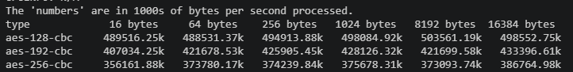
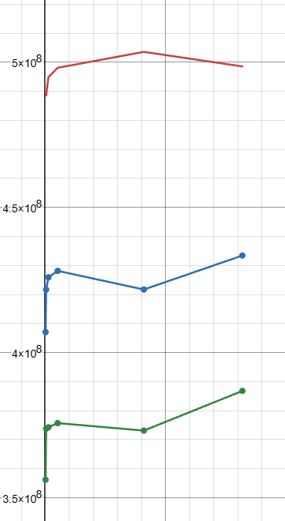
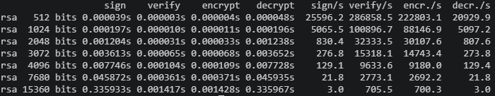
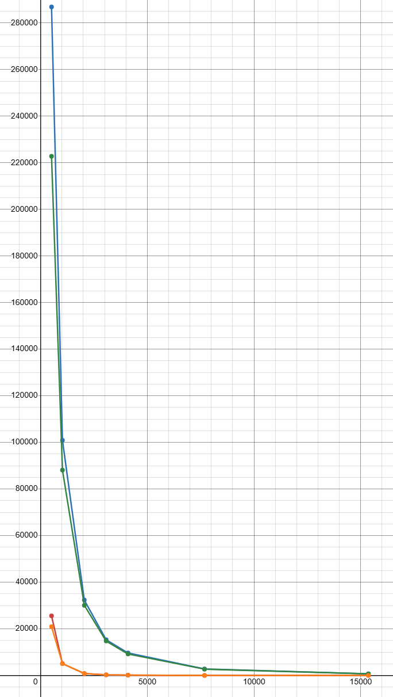

# AES graphs

 Top to bottom key sizes: 128, 192, 256

x-axis: block size

y-axis: throughput

# RSA Graphs

Red: sign, Blue: verify, Green: encrypt,
Orange: decrypt

x-axis: key size

y-axis: throughput

[Desmos Snapshot Link 
](https://www.desmos.com/calculator/1e7b2wacuz)